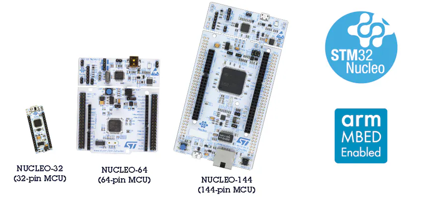
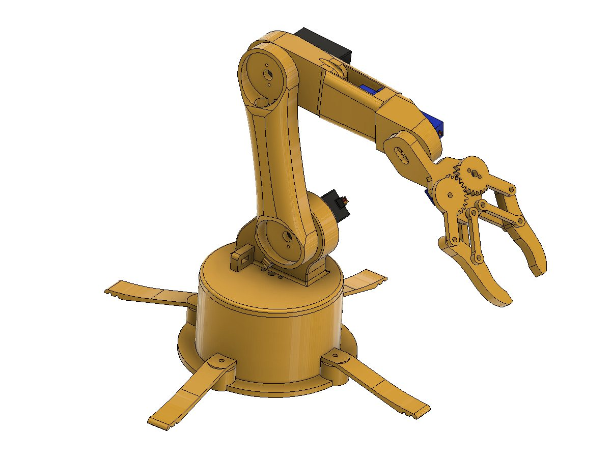
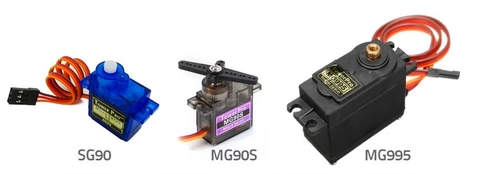

<h1 align="center">Profesor: MSc. Fabián Barrera Prieto 👨‍🏫 
Materia: Laboratorio de robótica 🦾 
Universidad: UMNG 🏫 
Año: 2026 📅</h1> 

El laboratorio de robótica está enfocado al desarrollo de plataformas móviles y brazos manipuladores programados a través de STM32, operados por medio de una interfaz gráfica en Matlab o Python. Este curso tiene un valor del 30% en la nota del primer y segundo corte del curso y del 50% en la nota del tercer corte del curso.

<h1>Aula 1</h1>

En esta clase se presenta la materia, en cuanto al contenido temático, los métodos de evaluación, las observaciones, las NO EXCUSAS y los recursos para el desarrollo del curso.

<h2>Presentación de la materia 🚀</h2>

<h3>TEMAS 🤓</h3>

<h4>Primer corte MEC B</h4>

<table>
	<tr>
		<td>Fecha</td> <td>Horas</td> <td>Clase</td> <td>Semana</td> <td>Actividades</td>
	</tr>
	<tr>
		<td>20/07/2026</td> <td>2</td> <td>1</td> <td>1</td> <td>FESTIVO</td>
	</tr>
	<tr>
		<td>27/07/2026</td> <td>2</td> <td>2</td> <td>2</td> <td>Presentación de la materia</td>
	</tr>
	<tr>
		<td>03/08/2026</td> <td>2</td> <td>3</td> <td>3</td> <td>Socialización guía No. 1 Socialización proyecto</td>
	</tr>
	<tr>
		<td>10/08/2026</td> <td>2</td> <td>4</td> <td>4</td> <td>Desarrollo y/o entrega de guía No. 1</td>
	</tr>
	<tr>
		<td>17/08/2026</td> <td>2</td> <td>5</td> <td>5</td> <td>FESTIVO</td>
	</tr>
	<tr>
		<td>24/08/2026</td> <td>2</td> <td>6</td> <td>6</td> <td>Desarrollo y/o entrega de guía No. 1 Entrega de notas primer corte</td>
	</tr> <!--semana de parciales del primer corte--><!--semana de registro de notas del primer corte-->
</table>

<h4>Segundo corte MEC B</h4>

<table>
	<tr>
		<td>Fecha</td> <td>Horas</td> <td>Clase</td> <td>Semana</td> <td>Actividades</td>
	</tr>
	<tr>
		<td>31/08/2026</td> <td>2</td> <td>7</td> <td>7</td> <td>Socialización guía No. 2</td>
	</tr>
	<tr>
		<td>07/09/2026</td> <td>2</td> <td>8</td> <td>8</td> <td>Desarrollo y/o entrega de guía No. 2</td>
	</tr>
	<tr>
		<td>14/09/2026</td> <td>2</td> <td>9</td> <td>9</td> <td>Desarrollo y/o entrega de guía No. 2</td>
	</tr>
	<tr>
		<td>21/09/2026</td> <td>2</td> <td>10</td> <td>10</td> <td>Desarrollo y/o entrega de guía No. 2</td>
	</tr>
	<tr>
		<td>28/09/2026</td> <td>2</td> <td>11</td> <td>11</td> <td>Desarrollo y/o entrega de guía No. 2 Entrega de notas segundo corte</td>
	</tr>
	<tr>
		<td>05/10/2026</td> <td></td> <td></td> <td></td> <td>SEMANA DE RECESO</td>
	</tr>
	<tr>
		<td>12/10/2026</td> <td>2</td> <td>12</td> <td>12</td> <td>FESTIVO</td>
	</tr><!--semana de parciales del segundo corte-->
</table>

<h4>Tercer corte MEC B</h4>

<table>
	<tr>
		<td>Fecha</td> <td>Horas</td> <td>Clase</td> <td>Semana</td> <td>Actividades</td>
	</tr>
	<tr>
		<td>19/10/2026</td> <td>2</td> <td>13</td> <td>13</td> <td>Socialización guía No. 3</td>
	</tr>
	<tr>
		<td>26/10/2026</td> <td>2</td> <td>14</td> <td>14</td> <td>Desarrollo y/o entrega de guía No. 3</td>
	</tr>
	<tr>
		<td>02/11/2026</td> <td>2</td> <td>15</td> <td>15</td> <td>FESTIVO</td>
	</tr><!--Finalización de clases-->
	<tr>
		<td>09/11/2026</td> <td>2</td> <td>16</td> <td>16</td> <td>Desarrollo y/o entrega de proyecto Entrega de notas finales</td>
	</tr>
	<tr>
		<td>16/11/2026</td> <td>2</td> <td>17</td> <td>17</td> <td>FESTIVO</td>
	</tr>
</table>

<h4>Primer corte MEC A</h4>

<table>
	<tr>
		<td>Fecha</td> <td>Horas</td> <td>Clase</td> <td>Semana</td> <td>Actividades</td>
	</tr>
	<tr>
		<td>24/07/2026</td> <td>2</td> <td>1</td> <td>1</td> <td>Presentación de la materia</td>
	</tr>
	<tr>
		<td>31/07/2026</td> <td>2</td> <td>2</td> <td>2</td> <td>Socialización guía No. 1 Socialización proyecto</td>
	</tr>
	<tr>
		<td>07/08/2026</td> <td>2</td> <td>3</td> <td>3</td> <td>FESTIVO</td>
	</tr>
	<tr>
		<td>14/08/2026</td> <td>2</td> <td>4</td> <td>4</td> <td>Desarrollo y/o entrega de guía No. 1</td>
	</tr>
	<tr>
		<td>21/08/2026</td> <td>2</td> <td>5</td> <td>5</td> <td>Desarrollo y/o entrega de guía No. 1 Entrega de notas primer corte</td>
	</tr> <!--semana de parciales del primer corte--><!--semana de registro de notas del primer corte-->
</table>

<h4>Segundo corte MEC A</h4>

<table>
	<tr>
		<td>Fecha</td> <td>Horas</td> <td>Clase</td> <td>Semana</td> <td>Actividades</td>
	</tr>
	<tr>
		<td>28/08/2026</td> <td>2</td> <td>6</td> <td>6</td> <td>Socialización guía No. 2</td>
	</tr>
	<tr>
		<td>04/09/2026</td> <td>2</td> <td>7</td> <td>7</td> <td>Desarrollo y/o entrega de guía No. 2</td>
	</tr>
	<tr>
		<td>11/09/2026</td> <td>2</td> <td>8</td> <td>8</td> <td>Desarrollo y/o entrega de guía No. 2</td>
	</tr>
	<tr>
		<td>18/09/2026</td> <td>2</td> <td>9</td> <td>9</td> <td>Desarrollo y/o entrega de guía No. 2</td>
	</tr>
	<tr>
		<td>25/09/2026</td> <td>2</td> <td>10</td> <td>10</td> <td>Desarrollo y/o entrega de guía No. 2</td>
	</tr>
	<tr>
		<td>02/10/2026</td> <td>2</td> <td>11</td> <td>11</td> <td>Desarrollo y/o entrega de guía No. 2 Entrega de notas segundo corte</td>
	</tr><!--semana de parciales del segundo corte-->
	<tr>
		<td>09/10/2026</td> <td></td> <td></td> <td></td> <td>SEMANA DE RECESO</td>
	</tr>
</table>

<h4>Tercer corte MEC A</h4>

<table>
	<tr>
		<td>Fecha</td> <td>Horas</td> <td>Clase</td> <td>Semana</td> <td>Actividades</td>
	</tr>
	<tr>
		<td>16/10/2026</td> <td>2</td> <td>12</td> <td>12</td> <td>Socialización guía No. 3</td>
	</tr>
	<tr>
		<td>23/10/2026</td> <td>2</td> <td>13</td> <td>13</td> <td>Desarrollo y/o entrega de guía No. 3</td>
	</tr>
	<tr>
		<td>30/10/2026</td> <td>2</td> <td>14</td> <td>14</td> <td>Desarrollo y/o entrega de guía No. 3</td>
	</tr>
	<tr>
		<td>06/11/2026</td> <td>2</td> <td>15</td> <td>15</td> <td>Desarrollo y/o entrega de guía No. 3</td>
	</tr><!--Finalización de clases-->
	<tr>
		<td>13/11/2026</td> <td>2</td> <td>16</td> <td>16</td> <td>Desarrollo y/o entrega de proyecto</td>
	</tr>
	<tr>
		<td>20/11/2026</td> <td>2</td> <td>17</td> <td>17</td> <td>Desarrollo y/o entrega de proyecto Entrega de notas finales</td>
	</tr>
</table>

<h3>MÉTODOS DE EVALUACIÓN ✍️</h3>

<h4>MEC B y C</h4>

<table>
	<tr>
		<td>Corte</td> <td>Actividad</td> <td>Porcentaje 💯</td> <td>Fecha</td> <td>Metodología</td>
	</tr>
	<tr>
		<td>Primer (9%)</td> <td>Guía No. 1 de laboratorio</td> <td>9%</td> <td>09/02/2026 16/02/2026 23/02/2026</td> <td rowspan="4">Presencial</td>
	</tr>
	<tr>
		<td>Segundo (9%)</td> <td>Guía No. 2 de laboratorio</td> <td>9%</td> <td>09/03/2026 16/03/2026 06/04/2026 13/04/2026</td>
	</tr>
	<tr>
		<td rowspan="2">Tercer (20%)</td> <td>Guía No. 3 de laboratorio</td> <td>7.5%</td> <td>27/04/2026 04/05/2026  
	</tr>
	<tr>
		<td>Proyecto</td> <td>12.5%</td> <td>11/05/2026 25/05/2026</td>
	</tr>
</table>

<h4>MEC A</h4>

<table>
	<tr>
		<td>Corte</td> <td>Actividad</td> <td>Porcentaje 💯</td> <td>Fecha</td> <td>Metodología</td>
	</tr>
	<tr>
		<td>Primer (9%)</td> <td>Guía No. 1 de laboratorio</td> <td>9%</td> <td>13/02/2026 20/02/2026 27/02/2026</td> <td rowspan="4">Presencial</td>
	</tr>
	<tr>
		<td>Segundo (9%)</td> <td>Guía No. 2 de laboratorio</td> <td>9%</td> <td>13/03/2026 20/03/2026 27/03/2026 10/04/2026 17/04/2026</td>
	</tr>
	<tr>
		<td rowspan="2">Tercer (20%)</td> <td>Guía No. 3 de laboratorio</td> <td>7.5%</td> <td>08/05/2026 15/05/2026  
	</tr>
	<tr>
		<td>Proyecto</td> <td>12.5%</td> <td>22/05/2026 29/05/2026</td>
	</tr>
</table>

Nota del curso = (***0.21***+0.09)*NotaCorte1 + (***0.21***+0.09)*NotaCorte2 + (***0.2***+0.2)*NotaCorte3

<h3>OBSERVACIONES ⚠️</h3>

<h4>Observaciones de clase</h4>
	<ul>
		<li> Inicio de clases: Quince (15) minutos después de la hora inicial definida de la clase y el control de asistencia se realiza a cada inicio de clase ⌚</li>
		<li> Fin de clases: Quince (15) minutos antes de la hora final definida de la clase ⏱️</li>
		<li> Respeto en clase 🤝</li>
		<li> No presto mi computador para presentar laboratorios, talleres y/o proyectos 🤦‍♂️</li>
		<li> Permitidas las salidas al baño 🚻 y a recibir llamadas 📲</li>
		<li> Si no dejan dictar la clase, pasan al tablero a dar la clase o doy la clase por vista 😤</li>
		<li> No es permitido tomar fotos, ni videos en clase 📵. El material de clase está en el siguiente repositorio git: https://github.com/FBarreraP/Laboratorio_Robotica </li>
		<li> Los laboratorios y el proyecto consistirán únicamente de montaje y podrán ser realizados en grupos de máximo 2 estudiantes 🧍‍♂️🧍‍♀️</li>
		<li> Los montajes realizados en protoboard no son aceptados con jumpers, por tanto, deben ser realizados con cable UTP y no son compartidos, es decir, un montaje por grupo 🤷‍♂️</li>
		<li> Los laboratorios y el proyecto se calificarán con rúbricas de 0.0 a 5.0 con intervalo de 1.0; las cuales tendrán diferentes entregables con fechas fijas de entrega y el orden de entrega de los grupos será definida por el profesor 💥</li> 
		<li> Uso obligatorio de bata blanca en el laboratorio de robótica 🥼</li>
	</ul>

<h4>Observaciones de reglamento estudiantil</h4>
<ul>
	<li> Revisión sobre la calificación solamente dentro de los dias (3) establecidos en el reglamento estudiantil </li>
	<li> Con el 20% de las fallas se pierde la materia</li>
	<li> Las ausencias a clases donde se saque una calificación se debe presentar la excusa familiar o laboral en la dirección del programa</li>
</ul>

<h3>NO EXCUSAS ❌</h3>

<ul>
	<li> Hace 5 minutos funcionaba (tengo un video funcionando) 😒</li>
	<li> Mi compañero tiene todo y no ha llegado 😐</li>
	<li> Mírelo ya, porque deja de funcionar 🤨</li>
	<li> Tengo más materias 🙄</li>
	<li> Trabajo y estudio 😶</li>
	<li> Se dañó en el bus 🤔</li>
	<li> No lo toque, no lo mire, ni se acerque mucho porque se daña 🤨</li>
</ul>

<h3>RECURSOS 🛠️</h3>

<ul>
	<li> Computador 💻</li>
	<li> Matlab</li>
	<li> STM-32</li>
	

	
	 
	<figcaption>Fuente: https://www.st.com/en/ecosystems/stm32-nucleo.html</figcaption>
	

	<li> Brazo robótico 5 GDL</li>
	

	
	 
	<figcaption>Fuente: https://yorobotics.co/producto/brazo-robotico-arduino-6-servos-5-dof-grados-libertad-mg90/</figcaption>
	

	<li> Servomotores</li>
	

	
	 
	<figcaption>Fuente: https://www.arcaelectronica.com/blogs/tutoriales/servomotores-arduino-sg90-mg90-mg995-mg996</figcaption>
	

</ul>